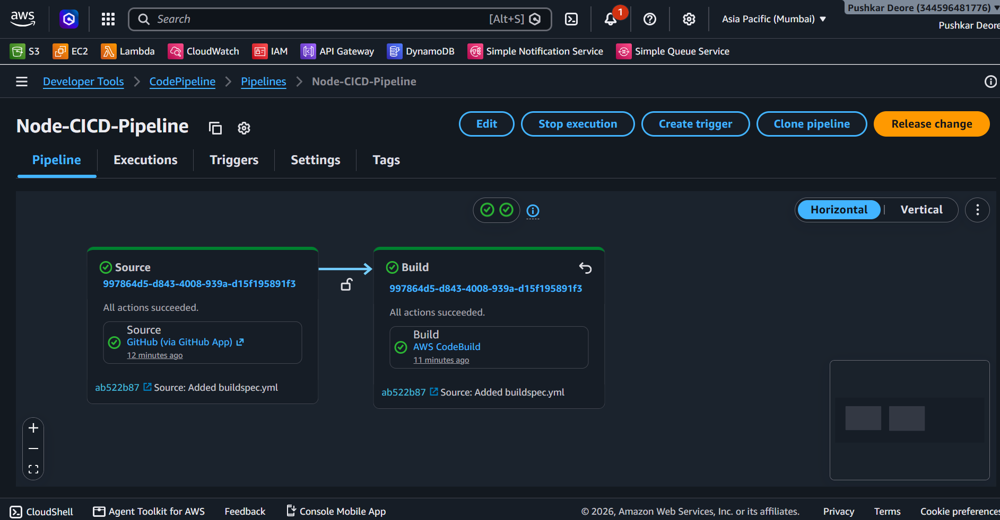
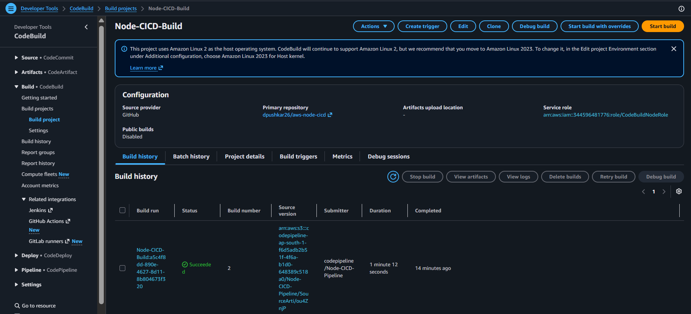
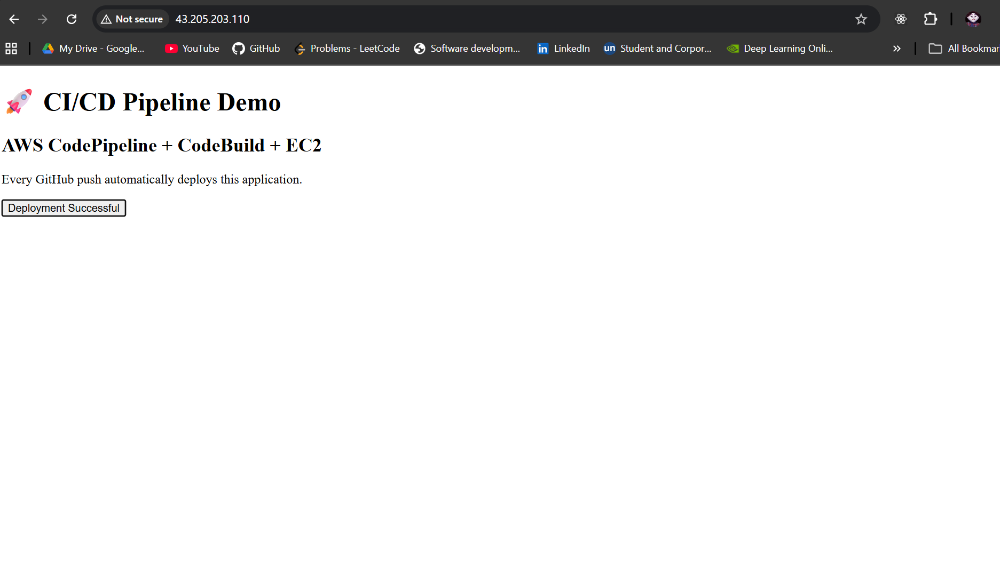

# AWS CI/CD Pipeline for Node.js Application

A Continuous Integration (CI) pipeline built using AWS services to automate the build process of a Node.js application. Every code change pushed to GitHub automatically triggers AWS CodePipeline, which builds the application using AWS CodeBuild. The application is hosted on an Amazon EC2 instance and managed with PM2 and Nginx.

## Architecture

```text
GitHub
   │
   ▼
AWS CodePipeline
   │
   ▼
AWS CodeBuild
   │
   ▼
Amazon EC2
(Node.js + PM2 + Nginx)
```



---

## AWS Services Used

- Amazon EC2
- AWS CodePipeline
- AWS CodeBuild
- IAM
- Amazon CloudWatch
- GitHub
- PM2
- Nginx

---

## Features

- Automated CI pipeline with AWS CodePipeline
- Automatic build on every GitHub push
- Node.js application hosted on Amazon EC2
- Process management using PM2
- Reverse proxy configuration with Nginx
- CloudWatch build logs
- IAM-based secure access

---

## Project Structure

```text
aws-node-cicd/
├── app.js
├── package.json
├── package-lock.json
├── buildspec.yml
├── public/
├── views/
└── README.md
```

---

## Build Specification

```yaml
version: 0.2

phases:
  install:
    runtime-versions:
      nodejs: 22
    commands:
      - npm install

  build:
    commands:
      - echo "Build Successful"

artifacts:
  files:
    - '**/*'
```

---

## CI Workflow

```text
Developer
    │
git push
    │
    ▼
GitHub Repository
    │
    ▼
AWS CodePipeline
    │
    ▼
AWS CodeBuild
    │
    ▼
Build Successful
```

---

## Screenshots

### CodePipeline / Architecture


### CodeBuild



### Application


